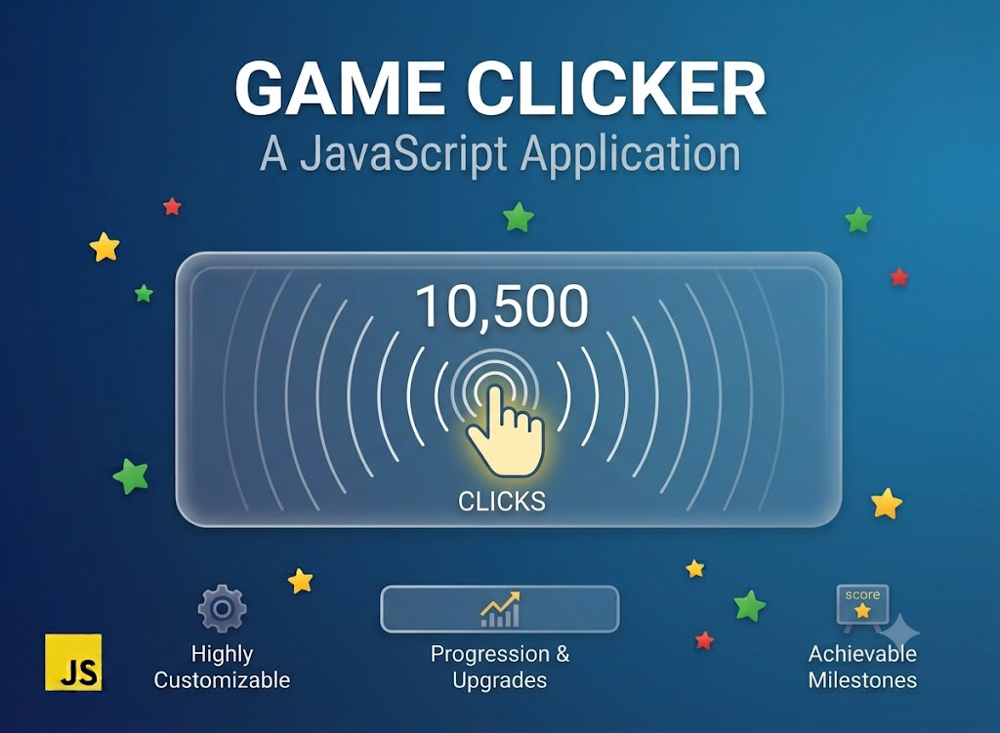

# Clicker Game — Lesson Project

Цей міні-проєкт реалізовано під час уроків з ментором як навчальний приклад роботи з DOM та інтерактивними подіями.

## Що робить проєкт

- створює інтерактивну гру на час, де гравець натискає на випадково згенеровані кружечки;
- дає можливість обрати тривалість партії (5, 15 або 30 секунд);
- оновлює таймер у реальному часі та рахує очки;
- показує фінальне повідомлення з результатом та пропозицією грати знову.

## Використані технології

- HTML для структури інтерфейсу та розмітки екранів гри;
- CSS для стилізації кнопок, екранів та анімаційних елементів;
- JavaScript для логіки гри, обробки подій і динамічного створення елементів.

## Навички, які відпрацьовано

- робота з DOM: `document.querySelectorAll`, `getElementById`, `classList`, `textContent`, `appendChild`, `remove`;
- обробка подій: `click`, делегування подій на список часу та натискання кружечка;
- робота з таймерами: `setInterval`, `clearInterval`;
- управління станом гри: вибір часу, зменшення часу, підрахунок очок, завершення гри;
- створення динамічних елементів: `document.createElement`, стилізація через `style`, позиціювання за допомогою `getBoundingClientRect`;
- використання `data-` атрибутів для передачі значень часу між HTML та JavaScript.

## Структура проєкту

- `index.html` — основна розмітка гри і кнопок для вибору часу;
- `style.css` — стилі для екранів гри, ігрового поля та кружечків;
- `script.js` — логіка старту гри, обробка кліків, створення випадкових кружечків, таймер та фінальна поведінка.

## Контекст створення

Цей проєкт зроблено на уроках з ментором як завершена навчальна вправа. Він показує практичне застосування базових фронтенд-навичок без потреби в подальших оновленнях.